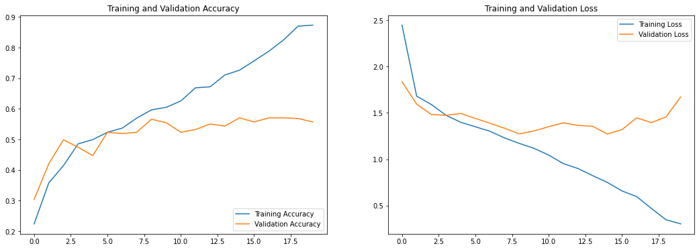
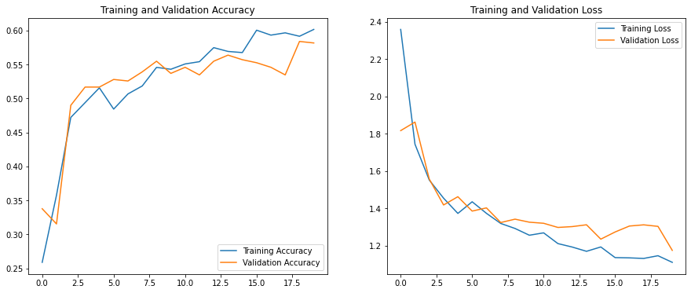
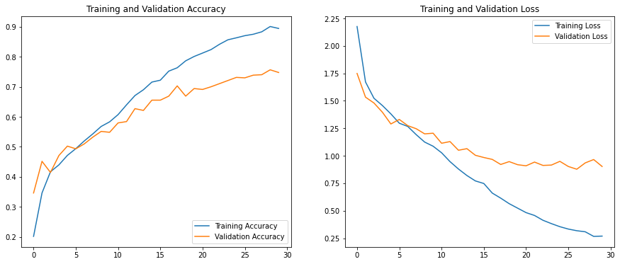
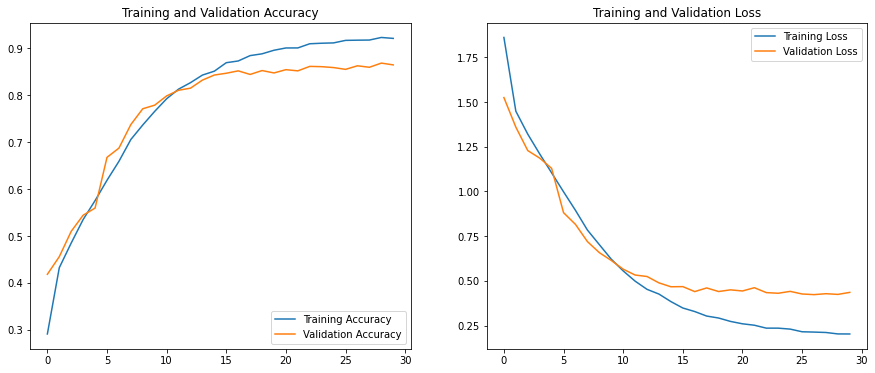

# Project Name
> Outline a brief description of your project.

## Table of Contents
* [General Info](#general-information)
* [Conclusions](#conclusions)
* [Technologies Used](#technologies-used)
* [Acknowledgements](#acknowledgements)

<!-- You can include any other section that is pertinent to your problem -->

## General Information
- To build a CNN based model which can accurately detect melanoma. 
- Melanoma is a type of cancer that can be deadly if not detected early. It accounts for 75% of skin cancer deaths. 
- A solution that can evaluate images and alert dermatologists about the presence of melanoma has the potential to reduce a lot of manual effort needed in diagnosis.
- The dataset consists of 2357 images of malignant and benign oncological diseases, which were formed from the International Skin Imaging Collaboration (ISIC)

<!-- You don't have to answer all the questions - just the ones relevant to your project. -->

## Conclusions
### Model 1
#### #### Accuracy and Loss for model 1

- Model 1 was trained for 20 epochs with available data
- Observations:
    - Model seems to be Overfitting
        - Train accuracy increases continuously
        - Validation accuracy increases in the beginning and then it remains constant
    - More data might help
    - More number of epochs will also help
    - Handling class imbalance might help
  
### Model 2
#### Accuracy and Loss for model 2 - keras augmentation

- Model 2 was trained for 20 epochs with keras built-in data augmentation.
- Following augmentations were used
    - Rotation
    - Zoom
    - Flip - vertical and horizontal
- Observations:
    - It shows much less overfitting
    - But accuracy also decreased - which means, fewer epochs results in underfitting
    - Thus Data augmentation helped in reducing overfitting
    - We need to run for more epochs to get better accuracy

### Model 3
#### Accuracy and Loss for model 3 - 500 images per class, 40 epochs

#### Accuracy and Loss for model 3 - 1500 images per class, 30 epochs

- Model 3 was trained for 30 epochs (1500 images) and 40 epochs (500 images)
- Augmentor was used to reduce class imbalance
- __1500 images are generated for each class instead of 500 to get better class balance__
- Observations:
    - Final model is still overfitting slightly
    - Validation accuracy is much better than model 1 and model 2
    - Rebalancing classes by increasing number of images helped in increasing accuracy
    - Increasing number of epochs also helped

#### Increasing Augmentor images to 1500 increases validation accuracy to 86%
#### Increasing images and epochs further will help reduce overfitting

<!-- You don't have to answer all the questions - just the ones relevant to your project. -->

## Technologies Used
- Python - 3.9.12
- Tensorflow - 2.8.0
- Augmentor - 0.2.9

<!-- As the libraries versions keep on changing, it is recommended to mention the version of library used in this project -->

## Acknowledgements
- [Tensorflow image classification tutorial](https://www.tensorflow.org/tutorials/images/classification).
- [Tensorflow data augmentation tutorial](https://www.tensorflow.org/tutorials/images/data_augmentation).

## Contact
Created by [@nvkhedkar] - feel free to contact me!

<!-- Optional -->
<!-- ## License -->
<!-- This project is open source and available under the [... License](). -->

<!-- You don't have to include all sections - just the one's relevant to your project -->